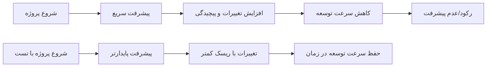
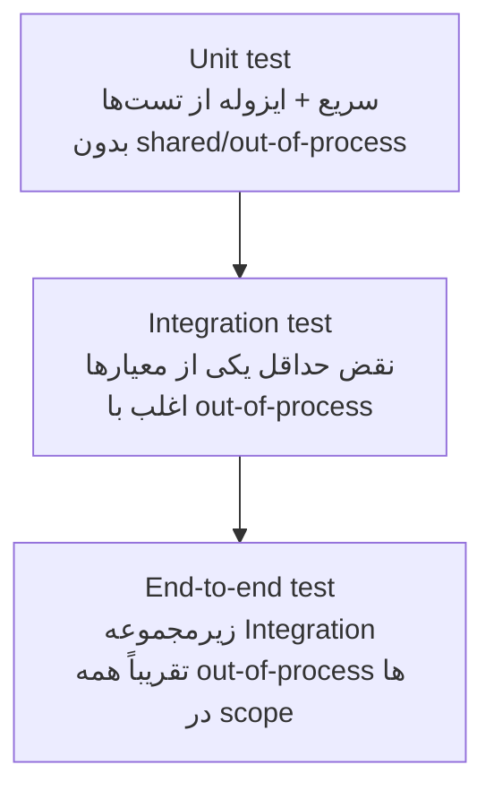
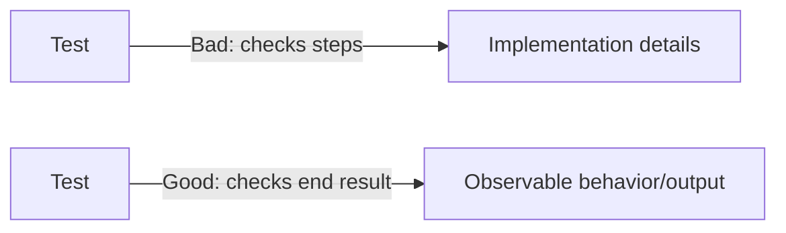

## توضیحات


## نظر

## نظر
 - `امتیاز` : 00/10
 - `به دیگران توصیه می‌کنم` : بله
 - `دوباره می‌خوانم` : بله
 - `ایده برجسته` : 
 - `تاثیر در من` : 
 - `نکات مثبت` : 
 - `نکات منفی` : 

## مشخصات
 - `نویسنده` : Vladimir Khorikov
 - `انتشارات` : Manning Publications
 - `لینک` : [ebooksworld](https://www.ebooksworld.ir/post/index/515/%D8%AF%D8%A7%D9%86%D9%84%D9%88%D8%AF-%DA%A9%D8%AA%D8%A7%D8%A8-unit-testing-principles-practices-and-patterns)

## بخش‌هایی از کتاب

## وضعیت فعلی Unit Testing (1.1)
کتاب می‌گوید طی دو دهه گذشته فشار زیادی برای پذیرش Unit Testing ایجاد شده و در بسیاری از شرکت‌ها عملاً به یک الزام تبدیل شده است.
اما چالش اصلی دیگر «آیا تست بنویسیم؟» نیست، بلکه «تست خوب یعنی چه؟» است و همین‌جا بیشترین سردرگمی رخ می‌دهد.
نویسنده مثال می‌زند پروژه‌هایی با تست‌های زیاد (حتی نسبت کد تست به کد تولیدی مثل 1:1 تا 1:3 و گاهی خیلی بیشتر) همچنان کند پیش می‌روند، باگ‌های تکراری دارند، و خود تست‌ها گاهی حتی وضعیت را بدتر می‌کنند چون درست “کار” نمی‌کنند.

## هدف واقعی Unit Testing (1.2)
کتاب تأکید می‌کند «بهبود طراحی» نتیجه جانبی Unit Testing است، نه هدف اصلی آن.
هدف اصلی Unit Testing از نگاه نویسنده این است که **رشد پایدار** پروژه نرم‌افزاری ممکن شود، یعنی سرعت توسعه در طول زمان حفظ شود و با بزرگ شدن سیستم فرو نریزد.
او این افت تدریجی سرعت را نوعی «آنتروپی نرم‌افزار» توصیف می‌کند: با هر تغییر، بی‌نظمی و پیچیدگی بالا می‌رود و اگر مراقبت (پاکسازی و refactoring مداوم) نباشد، اصلاح یک بخش باعث شکستن چند بخش دیگر می‌شود.


این نمودار، همان ایده‌ی کتاب را نشان می‌دهد که پروژه بدون تست معمولاً به سمت رکود می‌رود، ولی تست‌ها مثل «تور ایمنی» جلوی سقوط سرعت را می‌گیرند.

## تست‌ها چه چیزی را محافظت می‌کنند؟
کتاب «Regression» را حالتی تعریف می‌کند که بعد از یک رویداد (معمولاً تغییر کد)، یک قابلیت دیگر مثل قبل کار نکند و آن را هم‌معنی با «باگ نرم‌افزاری» در عمل در نظر می‌گیرد.
نویسنده می‌گوید تست‌ها با ایجاد یک safety net از بخش بزرگی از regressionها جلوگیری می‌کنند تا بتوان هم ویژگی جدید اضافه کرد و هم refactor انجام داد بدون اینکه عملکردهای قبلی ناخواسته خراب شوند.
در عین حال، این تور ایمنی رایگان نیست و هزینه اولیه دارد، ولی قرار است در بلندمدت با حفظ سرعت توسعه «بازپرداخت» شود.

## چرا تست خوب/بد مهم است؟ (شروع 1.2.1)
کتاب نشان می‌دهد داشتن تست به‌تنهایی کافی نیست و «تست بد» فقط کمی روند تخریب را کند می‌کند، اما در تصویر کلی باز هم پروژه می‌تواند به رکود برسد (فقط دیرتر).
بنابراین باید هم‌زمان دو چیز دیده شود: «ارزش» هر تست و «هزینه نگه‌داری» آن، چون امکان دارد ارزش خالص بعضی تست‌ها نزدیک صفر یا حتی منفی شود.
کتاب چند نمونه از هزینه‌های نگه‌داری را نام می‌برد: تغییر دادن تست هنگام refactor کد، اجرای تست روی هر تغییر، رسیدگی به false alarmها، و زمانی که صرف خواندن/فهمیدن تست برای درک رفتار کد می‌شود.

---

## Coverage Metric چیست؟
کتاب Coverage metric را عددی بین ۰ تا ۱۰۰ تعریف می‌کند که نشان می‌دهد تست‌ها چه مقدار از سورس‌کد را اجرا کرده‌اند، نه اینکه واقعاً «درستی رفتار» را ثابت کرده باشند.
همچنین تأکید می‌کند «کد تست» هم مثل کد تولیدی یک هزینه و بدهی (liability) دارد و هرچه کد بیشتر شود، سطح نگه‌داری و احتمال باگ هم بالا می‌رود.
پس ذهنیت «هرچه تست بیشتر، بهتر» بدون توجه به ارزش/هزینه‌ی تست‌ها، می‌تواند به تصمیم‌های اشتباه منجر شود.

## Code coverage (Test coverage)
کتاب می‌گوید Code coverage نسبتِ «تعداد خطوطی از کد تولیدی که حداقل توسط یک تست اجرا شده‌اند» به «کل خطوط کد تولیدی» است.
نویسنده با یک مثال نشان می‌دهد این معیار به راحتی قابل دستکاری است: اگر همان منطق را فشرده‌تر (کم‌خط‌تر) بنویسی، ممکن است Coverage بالا برود بدون اینکه کیفیت تست‌ها بهتر شده باشد.
نتیجه‌ی عملی این است که Code coverage بیشتر، لزوماً به معنی تست‌های بهتر نیست و فقط می‌گوید کد اجرا شده است.

## Branch coverage
کتاب Branch coverage را دقیق‌تر از Code coverage معرفی می‌کند چون به‌جای تعداد خط، روی «شاخه‌های کنترل جریان» مثل if/switch تمرکز می‌کند و می‌سنجد چند شاخه حداقل یک بار توسط تست‌ها پیمایش شده‌اند.
در مثال کتاب، یک متد ساده دو مسیر (دو شاخه) دارد و اگر تست فقط یکی از آن‌ها را طی کند، Branch coverage به‌صورت طبیعی ۵۰٪ می‌شود، حتی اگر کد را کوتاه/بلند نوشته باشی.
کتاب همچنین پیشنهاد می‌دهد می‌توان مسیرهای ممکن را مثل یک گراف دید تا مشخص شود تست‌ها کدام مسیرها را پوشش داده‌اند.

## مشکلات Coverage (1.3.3)
کتاب دو مشکل بنیادی برای Coverage metrics بیان می‌کند که باعث می‌شود نتوان از آن‌ها برای سنجش کیفیت تست‌سوییت استفاده کرد.
- اول: هیچ Coverage متریکی تضمین نمی‌کند تست‌ها همه خروجی‌های مهم را «assert» کرده‌اند؛ ممکن است کد اجرا شود ولی بخشی از نتیجه اصلاً بررسی نشود، یا حتی تست‌ها بدون assertion نوشته شوند و بی‌معنی ولی همیشه سبز باشند.
- دوم: Coverage metrics مسیرهای داخل کتابخانه‌های خارجی (مثلاً مسیرهای داخلی یک parse در فریم‌ورک) را نمی‌بینند، پس حتی با Branch coverage ۱۰۰٪ هم ممکن است تست از نظر edge caseها بسیار غیرکامل باشد.
کتاب یک داستان واقعی هم نقل می‌کند که وقتی مدیریت «۱۰۰٪ code coverage اجباری» گذاشت، تیم‌ها برای دور زدن سیستم به سمت تست‌های بی‌ارزش (مثلاً بدون assertion) رفتند و در نهایت این سیاست عقب‌نشینی کرد.

## هدف‌گذاری عددی Coverage (1.3.4)
کتاب می‌گوید تبدیل کردن Coverage به «هدف» (مثل ۷۰٪، ۹۰٪، ۱۰۰٪) انگیزه‌ی معیوب ایجاد می‌کند و افراد را از تست‌کردن چیزهای مهم به سمت بالا بردن مصنوعی عدد می‌برد.
نویسنده Coverage را «indicator» می‌داند نه «goal» و برای توضیح، تمثیل بیمارستان و تب را می‌آورد: دما نشانه است، ولی هدف‌گذاریِ عددیِ دما با هر روش ممکن می‌تواند به درمان غلط منجر شود.
جمع‌بندی این بخش در کتاب این است که Coverage پایین (مثلاً زیر حدود ۶۰٪) علامت خطر جدی است، ولی Coverage بالا به‌تنهایی هیچ تضمینی درباره کیفیت تست‌سوییت نمی‌دهد.

---

## تعریف Unit Test (2.1)
کتاب می‌گوید اگر تعریف‌های مختلف Unit Test را به هسته‌شان تقلیل دهیم، سه ویژگی مشترک دارند: یک بخش کوچک از کد را بررسی می‌کند، سریع اجرا می‌شود، و به شکل «ایزوله» انجام می‌شود.
دو ویژگی اول معمولاً محل بحث نیستند، ولی ویژگی سوم (ایزوله بودن) همان نقطه‌ای است که باعث دو تفسیر متفاوت و شکل‌گیری دو مدرسه فکری شده است.

## مسئله Isolation چیست؟
کتاب می‌گوید اختلاف اصلی این است که «ایزوله بودن» را دقیقاً چه چیزی بدانیم: ایزوله کردن کدِ تحت تست از همکارانش، یا ایزوله کردن خودِ تست‌ها از هم.
همین اختلاف ظاهراً کوچک، روی دو موضوع مهم دیگر هم اثر زنجیره‌ای می‌گذارد: اینکه «unit» دقیقاً چیست، و وابستگی‌ها (dependencies) در تست‌ها چگونه مدیریت شوند.

## نگاه London به Isolation (2.1.1)
در نگاه London، ایزوله کردن یعنی **جدا کردن SUT از collaboratorها** با جایگزینی dependencyها توسط test doubleها (مثل mock).
کتاب test double را آبجکتی تعریف می‌کند که شبیه نمونه واقعی رفتار می‌کند اما ساده‌سازی شده تا تست را آسان‌تر کند، و mock را نوع خاصی از test double می‌داند که امکان بررسی تعاملات SUT با collaborator را می‌دهد.
این رویکرد دو مزیت مطرح می‌کند: اگر تست fail شود مظنون اصلی SUT است، و همچنین می‌توان گراف وابستگی‌های پیچیده را با بریدن dependencyها ساده کرد (برای اینکه لازم نباشد کل object graph در تست ساخته شود).

## نگاه Classical به Isolation (2.1.2 + 2.2)
در نگاه Classical، «کد» الزاماً از هم جدا نمی‌شود؛ بلکه **خود تست‌ها** باید از هم ایزوله باشند تا بتوانند مستقل از ترتیب اجرا (و حتی موازی) اجرا شوند و نتیجه همدیگر را خراب نکنند.
این نگاه می‌گوید تا وقتی همه‌چیز داخل حافظه و بدون shared state باشد، تست می‌تواند چند کلاس را همزمان exercise کند و هنوز unit test محسوب شود.
بنابراین در Classical معمولاً فقط dependencyهایی با shared state (مثل دیتابیس/فایل‌سیستم/فیلد static mutable) با test double جایگزین می‌شوند، هم برای جلوگیری از تداخل بین تست‌ها و هم برای سریع ماندن تست‌ها.

### جدول تفاوت‌ها (خلاصه 2.2)
| موضوع | London school | Classical school |
|---|---|---|
| Isolation روی چه چیزی؟ | روی «unitها/SUT و collaboratorها»  | روی «تست‌ها از هم»  |
| unit چیست؟ | معمولاً یک کلاس  | یک کلاس یا مجموعه‌ای از کلاس‌ها (واحد رفتار)  |
| از test double کجا استفاده می‌شود؟ | برای همه dependencyها به‌جز immutableها  | عمدتاً فقط برای shared dependencyها  |

### دسته‌بندی dependencyها (اصطلاحات کلیدی)
کتاب dependency را از منظر تست به «shared» و «private» تقسیم می‌کند و توضیح می‌دهد shared dependency یعنی چیزی که بین تست‌ها مشترک است و امکان اثرگذاری روی نتیجه همدیگر را فراهم می‌کند.
همچنین distinction بین out-of-process و shared را مهم می‌داند: اغلب out-of-processها shared هستند، اما همیشه نه (مثلاً یک read-only API می‌تواند out-of-process باشد ولی چون قابل تغییر نیست، لزوماً shared نیست).
کتاب علاوه بر این، مفهوم value object/immutable را مطرح می‌کند و می‌گوید London معمولاً immutableها را mock نمی‌کند چون state قابل تغییر ندارند.

```mermaid
flowchart TB
  D[Dependency] --> S[Shared dependency]
  D --> P[Private dependency]
  P --> M[Mutable]
  P --> I[Immutable (Value Object)]
  S --> O[Often out-of-process\n(DB, file system)]
```
---

## ادعاهای مکتب London (2.3)
کتاب می‌گوید تفاوت اصلی London و Classical از «تعریف isolation» می‌آید و همین اختلاف روی تعریف unit و نحوه برخورد با dependencyها اثر زنجیره‌ای می‌گذارد.
نویسنده صریحاً می‌گوید به دلایلی که بعداً (به‌خصوص در فصل ۵) باز می‌کند، Classical معمولاً تست‌های باکیفیت‌تری تولید می‌کند چون تست‌های مبتنی بر mock بیشتر مستعد شکنندگی هستند.
سپس سه مزیت رایجِ London را فهرست می‌کند: granularity بهتر (تست یک کلاس در هر تست)، آسان‌تر شدن تستِ گراف‌های بزرگ از کلاس‌های وابسته، و راحت‌تر شدن تشخیص اینکه باگ دقیقاً در کدام بخش رخ داده است.

## «یک کلاس» در برابر «یک رفتار» (2.3.1)
کتاب می‌گوید تمرکز روی «تستِ یک کلاس» معمولاً گمراه‌کننده است چون تست‌ها باید «واحد رفتار» را بررسی کنند نه «واحد کد».
نویسنده یک نکته کلیدی می‌دهد: اگر تست یک رفتارِ معنادار و قابل‌تشخیص برای مسئله (حتی برای یک فرد غیر برنامه‌نویس) را بررسی کند، تعداد کلاس‌هایی که آن رفتار را پیاده‌سازی کرده‌اند مهم نیست.
کتاب توضیح می‌دهد وقتی به جای رفتار، روی اجزای داخلی (مثل یک کلاس یا چند متد کوچک) زوم شود، تست‌ها شبیه روایتِ تکه‌تکه و غیرقابل‌فهم می‌شوند و تشخیص اینکه «اصل رفتار» چه بوده سخت‌تر می‌شود.

## گراف وابستگی بزرگ (2.3.2)
کتاب قبول می‌کند که mock کردن collaboratorها می‌تواند تست کردن یک کلاس در یک dependency graph پیچیده را آسان‌تر کند، چون فقط dependencyهای مستقیم را جایگزین می‌کنی و لازم نیست کل گراف را بسازی.
اما بلافاصله نقد می‌کند که این استدلال دارد «مسئله اشتباه» را حل می‌کند: به جای اینکه دنبال راهی برای تست کردن یک گراف بزرگ و درهم‌تنیده باشی، باید دنبال این باشی که اصلاً چنین گرافی تولید نشود.
کتاب می‌گوید اگر برای تست کردن یک کلاس، Arrange خیلی طولانی و فراتر از حد معقول می‌شود، این معمولاً علامت مشکل طراحی است و mock فقط آن مشکل را پنهان می‌کند نه اینکه ریشه‌اش را حل کند.

## پیدا کردن محل باگ (2.3.3)
کتاب می‌گوید در London-style معمولاً اگر یک باگ ایجاد شود، اغلب همان تست‌هایی fail می‌شوند که SUTشان باگ دارد، ولی در Classical ممکن است «اثر موجی» رخ دهد و تست‌های کلاینت‌های آن کلاس هم fail شوند.
نویسنده می‌پذیرد این می‌تواند پیدا کردن ریشه را سخت‌تر کند، اما استدلال می‌کند اگر تست‌ها مرتب (ترجیحاً بعد از هر تغییر) اجرا شوند، معمولاً معلوم است چه چیزی باعث باگ شده چون همان چیزی است که تازه تغییر کرده است.
کتاب همچنین می‌گوید این موج fail شدن‌ها گاهی اطلاعات مفیدی هم می‌دهد: اگر باگ باعث fail شدن تعداد زیادی تست شود، یعنی آن قطعه کد در سیستم ارزش و وابستگی بالایی دارد.

## تفاوت‌های دیگر و over-specification (2.3.4)
کتاب دو تفاوت دیگر را هم نام می‌برد: London معمولاً به outside-in TDD نزدیک می‌شود (شروع از لایه‌های بالاتر و تعیین انتظارها با mock)، و Classical بیشتر inside-out (شروع از domain model و سپس لایه‌های بالاتر).
اما مهم‌ترین اختلاف از نگاه نویسنده، مسئله **over-specification** است: در London-style، تست‌ها بیشتر به جزئیات پیاده‌سازی SUT گره می‌خورند چون به جای نتیجه نهایی، تعاملات داخلی (چه متدی، چند بار، با چه پارامترهایی) را قفل می‌کنند.
کتاب می‌گوید همین coupling به implementation detail بزرگ‌ترین ایراد استفاده فراگیر از mock است و قرار است از فصل ۴ به بعد، بحث mocking را دقیق‌تر و مرحله‌ای باز کند.

---

## تعریف Integration Test در دو مکتب
کتاب می‌گوید London school معمولاً هر تستی را که از یک collaborator واقعی (به‌جای test double) استفاده کند، «integration test» حساب می‌کند.
در مقابل، کتاب با رویکرد Classical تعریف می‌کند: **Unit test** باید (۱) یک واحد رفتار را بررسی کند، (۲) سریع باشد، و (۳) از سایر تست‌ها ایزوله اجرا شود؛ پس **Integration test** هر تستی است که حداقل یکی از این سه شرط را نقض کند.
نویسنده تصریح می‌کند در این کتاب از همین تعریف Classical برای unit/integration استفاده می‌کند.

## چه چیزهایی تست را Integration می‌کند؟
کتاب توضیح می‌دهد اگر تست به یک **shared dependency** (مثل دیتابیس یا فایل‌سیستم) وصل شود، دیگر «ایزوله از سایر تست‌ها» نیست، چون تست‌ها می‌توانند با تغییر state آن dependency روی هم اثر بگذارند (خصوصاً در اجرای موازی).
همچنین کتاب می‌گوید تماس با dependencyهای خارج از پردازه (out-of-process) معمولاً تست را کند می‌کند و همین کندی هم باعث می‌شود از محدوده unit test خارج شود و در عمل به integration test نزدیک شود.
علاوه بر این، کتاب اشاره می‌کند گاهی برای بهینه‌سازی زمان اجرای suite، ممکن است عمداً چند «واحد رفتار» در یک تست ترکیب شوند؛ در این حالت هم تست دیگر unit test نیست و در دسته integration قرار می‌گیرد.

## End-to-end زیرمجموعه Integration (2.4.1)
کتاب می‌گوید End-to-end test یک نوع integration test است که سیستم را از دید کاربر نهایی و با **بیشترین** (یا تقریباً همه) dependencyهای بیرونی در scope بررسی می‌کند.
در حالی‌که یک integration test معمولاً فقط با «یک یا دو» dependency بیرونی کار می‌کند و بقیه را با test double جایگزین می‌کند (مثلاً دیتابیس واقعی + فایل‌سیستم واقعی، ولی payment gateway با mock).
کتاب اشاره می‌کند اصطلاحاتی مثل UI test / GUI test / functional test در عمل اغلب نزدیک به همین مفهوم end-to-end استفاده می‌شوند و مرزها همیشه کاملاً شفاف نیست.


این نمودار همان طبقه‌بندی کتاب را نشان می‌دهد که End-to-end را زیرمجموعه Integration و Integration را «هر چیزی غیر از Unit test» (طبق تعریف Classical) در نظر می‌گیرد.

---

## الگوی AAA (3.1.1)
کتاب الگوی AAA (Arrange, Act, Assert) را پیشنهاد می‌کند: هر تست به سه بخش «آماده‌سازی»، «اجرا»، و «بررسی نتیجه» تقسیم شود.
مزیت اصلی AAA از نگاه کتاب، ایجاد یک ساختار **یکنواخت** برای کل تست‌سوییت است که خواندن تست‌ها را سریع‌تر می‌کند و هزینه نگه‌داری را پایین می‌آورد.
کتاب توضیح می‌دهد در Arrange وضعیت SUT و وابستگی‌ها آماده می‌شود، در Act یک رفتار روی SUT اجرا می‌شود و خروجی (اگر وجود دارد) گرفته می‌شود، و در Assert نتیجه بررسی می‌شود.

## چند AAA و if ممنوع (3.1.2, 3.1.3)
کتاب می‌گوید داشتن چندین Act/Assert در یک تست معمولاً نشانه این است که تست «چند چیز را با هم» بررسی می‌کند و بهتر است به چند تست شکسته شود.
در عین حال کتاب اشاره می‌کند چند Act/Assert در **Integration Test**‌های کند گاهی به‌عنوان بهینه‌سازی قابل قبول است (چون می‌تواند سرعت اجرای کلی را بهتر کند)، اما برای Unit Test‌ها بهتر است از آن اجتناب شود.
همچنین وجود if در تست را anti-pattern می‌داند، چون تست نباید branching داشته باشد و if معمولاً یعنی تست بیش از حد مسئولیت گرفته و باید شکسته شود.

## اندازه بخش‌ها (3.1.4, 3.1.5)
کتاب می‌گوید Arrange معمولاً بزرگ‌ترین بخش است و می‌تواند هم‌اندازه مجموع Act و Assert باشد، اما اگر خیلی بزرگ‌تر شد بهتر است آماده‌سازی‌ها به متدهای خصوصی یا یک factory منتقل شود و از الگوهایی مثل Object Mother و Test Data Builder برای کاهش تکرار استفاده شود.
کتاب یک علامت هشدار مهم می‌دهد: Act به‌طور معمول باید «یک خط» باشد و اگر چند خط شد، احتمالاً API عمومی SUT مشکل دارد (یعنی برای انجام یک عملیات، کلاینت مجبور به چند تماس شده و این می‌تواند به نقض invariant منجر شود).
درباره Assert هم می‌گوید قانون «یک assertion برای هر تست» الزاماً درست نیست، چون یک «واحد رفتار» می‌تواند چند خروجی/پیامد داشته باشد و بررسی همه آن‌ها در یک تست مجاز است، اما Assert خیلی بزرگ می‌تواند نشانه نبود abstraction مناسب در کد production باشد.

## teardown و نام‌گذاری SUT (3.1.6, 3.1.7, 3.1.8)
کتاب teardown را مرحله‌ای جدا (بعد از AAA) می‌داند، اما می‌گوید اغلب Unit Test‌ها به teardown نیاز ندارند چون نباید با out-of-process dependency کار کنند و معمولاً side effect قابل پاکسازی ایجاد نمی‌کنند (این جنس cleanup بیشتر مربوط به Integration Test است).
برای خوانایی، کتاب توصیه می‌کند شیء «System Under Test» را در تست‌ها همیشه با نام `sut` مشخص کنی تا بین SUT و dependencyها سردرگمی ایجاد نشود.
همچنین می‌گوید به‌جای کامنت‌های Arrange/Act/Assert، در بسیاری از تست‌ها جدا کردن بخش‌ها با یک خط خالی کافی و خواناست، مگر تست‌های بزرگ‌تر (به‌خصوص integration) که ممکن است به جداسازی‌های واضح‌تری نیاز داشته باشند.

### نمونه کوتاه (xUnit/AAA)
```csharp
public sealed class Calculator
{
    public int Sum(int first, int second) => first + second;
}

public sealed class CalculatorTests
{
    [Fact]
    public void Sum_of_two_numbers()
    {
        var first = 10;
        var second = 20;
        var sut = new Calculator();

        var result = sut.Sum(first, second);

        Assert.Equal(30, result);
    }
}
```

---

## xUnit در یک نگاه (3.2)
کتاب می‌گوید در .NET چند فریم‌ورک رایج برای تست وجود دارد (xUnit، NUnit و MSTest) و در این کتاب از xUnit استفاده می‌شود.
نویسنده تأکید می‌کند برای اجرای تست‌های xUnit در Visual Studio معمولاً باید پکیج `xunit.runner.visualstudio` را نصب کرد.
کتاب دلیل علاقه به xUnit را «ساده‌سازی» مفاهیم می‌داند؛ برای مثال با یک attribute مثل `Fact` می‌توان یک تست را مشخص کرد و بسیاری از چیزهایی که در برخی فریم‌ورک‌ها با attributeهای اضافی انجام می‌شود، در xUnit با convention و سازوکارهای خود زبان انجام می‌شود.

## Setup و Teardown با constructor/IDisposable
کتاب توضیح می‌دهد اگر لازم باشد کد مشترکی قبل از هر تست اجرا شود، می‌توان آن را در constructor کلاس تست گذاشت.
همچنین اگر لازم باشد بعد از هر تست cleanup انجام شود، می‌توان `IDisposable` را پیاده‌سازی کرد تا `Dispose` بعد از هر تست اجرا شود.
نویسنده نکته‌ی معنایی جالبی هم مطرح می‌کند: اسم `Fact` به‌جای `Test` کمک می‌کند تست را به‌عنوان یک «واقعیت/سناریوی اتمیک» درباره رفتار سیستم ببینی، نه صرفاً یک چک‌لیست از کد.

## Reuse کردن fixtureها (3.3)
کتاب می‌گوید تکرار Arrange طبیعی است و استخراج تنظیمات مشترک می‌تواند تست‌ها را کوتاه‌تر و ساده‌تر کند، اما روش انجام این کار بسیار مهم است.
روش نامطلوب از نگاه کتاب این است که fixtureها (مثل `Store` و `Customer`) را در constructor ساخته و در فیلدهای private نگه‌داری کنی، چون این کار «shared state» داخل کلاس تست ایجاد می‌کند و باعث coupling بین تست‌ها می‌شود.
همچنین کتاب می‌گوید constructor خوانایی تست را کم می‌کند چون دیگر با نگاه کردن به خود تست، تصویر کامل Arrange را نمی‌بینی و مجبور می‌شوی بین بخش‌های مختلف کلاس رفت‌وبرگشت کنی.

## روش پیشنهادی: Factory methodهای خصوصی
راه بهتر از نگاه کتاب این است که به‌جای constructor، متدهای factory خصوصی بسازی تا هر تست واضح بگوید چه fixtureای با چه تنظیماتی می‌خواهد (مثلاً چه محصولی و چه تعدادی موجودی).
کتاب تأکید می‌کند این factoryها باید به‌اندازه کافی general باشند تا تست‌ها بتوانند پارامترهای موردنیازشان را مشخص کنند و مجبور نشوی با تغییر یک تست، بقیه تست‌ها هم ناخواسته تحت‌تأثیر قرار بگیرند.

نمونه (سبک پیشنهادی کتاب، با factory method):

```csharp
public sealed class CustomerTests
{
    [Fact]
    public void Purchase_succeeds_when_enough_inventory()
    {
        var store = CreateStoreWithInventory(Product.Shampoo, 10);
        var sut = CreateCustomer();

        var success = sut.Purchase(store, Product.Shampoo, 5);

        Assert.True(success);
        Assert.Equal(5, store.GetInventory(Product.Shampoo));
    }

    private static Store CreateStoreWithInventory(Product product, int quantity)
    {
        var store = new Store();
        store.AddInventory(product, quantity);
        return store;
    }

    private static Customer CreateCustomer() => new Customer();
}
```

---

## نام‌گذاری تست‌ها (3.4)
کتاب می‌گوید نام تست باید به فهم «رفتار» کمک کند، نه اینکه صرفاً قالب مکانیکی مثل `MethodUnderTest_Scenario_ExpectedResult` را پر کند.
این قالب‌های rigid معمولاً تست را به جزئیات پیاده‌سازی نزدیک می‌کنند و خوانایی واقعی را کم می‌کنند، حتی اگر برای برنامه‌نویس “منطقی” به نظر برسند.
کتاب پیشنهاد می‌کند نام تست را طوری بنویسی که انگار داری سناریو را برای یک فرد غیر برنامه‌نویسِ آشنا با دامنه مسئله (مثلاً BA/Domain Expert) توضیح می‌دهی و برای خوانایی، کلمات را با underscore جدا کنی.

## راهنمای نام خوب (3.4.1)
کتاب چند guideline مشخص می‌دهد:
- از یک naming policy سخت‌گیرانه پیروی نکن، چون توصیف رفتارهای پیچیده داخل یک قالب ثابت جا نمی‌شود.
- نام تست را “جمله‌وار” و نزدیک به زبان طبیعی بنویس تا روایت رفتار باشد.
- کلمات را با `_` جدا کن تا نام‌های طولانی هم سریع خوانده شوند.
- نام متد SUT را داخل نام تست نیاور، چون تست باید رفتار را پوشش دهد و تغییر نام متد نباید باعث اجبار به تغییر نام تست شود.

## نمونه بهبود نام (3.4.2)
کتاب یک مثال می‌زند که از نام مکانیکی (مثل «فلان متد با تاریخ نامعتبر false برمی‌گرداند») شروع می‌شود و مرحله‌به‌مرحله به یک جمله واضح و کوتاه می‌رسد.
نکته کلیدی مثال این است که به جای «should be» (که حالت آرزو/خواستن دارد)، تست را مثل یک fact نام‌گذاری کن (مثلاً “... is invalid”) تا با ماهیت تست به‌عنوان «واقعیت اتمیک» هم‌راستا شود.
همچنین کتاب تأکید می‌کند با مشخص‌تر کردن سناریو (مثلاً «تاریخ گذشته» به جای «تاریخ نامعتبر») نام تست دقیق‌تر می‌شود و سریع‌تر به نیازمندی دامنه وصل می‌شود.

## تست‌های پارامتری (3.5)
کتاب می‌گوید یک رفتار معمولاً با چند “fact” توصیف می‌شود و اگر این factها فقط در ورودی/خروجی تفاوت دارند، می‌توان آن‌ها را با **Parameterized Test** در یک متد تجمیع کرد تا حجم کد تست کمتر شود.
در xUnit برای این کار از `Theory` به جای `Fact` استفاده می‌شود و هر `InlineData` نماینده یک fact/سناریوی مستقل است.
کتاب هشدار می‌دهد این کاهش کد یک trade-off دارد: هرچه تست genericتر شود، از روی اسم تست کمتر می‌توان فهمید دقیقاً چه factهایی پوشش داده شده‌اند، پس باید بین اختصار و خوانایی تعادل برقرار کرد.

نمونه (Theory + InlineData):
```csharp
public sealed class DeliveryServiceTests
{
    [Theory]
    [InlineData(-1, false)]
    [InlineData(0, false)]
    [InlineData(1, false)]
    [InlineData(2, true)]
    public void Can_detect_an_invalid_delivery_date(int daysFromNow, bool expected)
    {
        var sut = new DeliveryService();
        var deliveryDate = DateTime.Now.AddDays(daysFromNow);
        var delivery = new Delivery { Date = deliveryDate };

        var isValid = sut.IsDeliveryValid(delivery);

        Assert.Equal(expected, isValid);
    }
}
```

## تولید داده و Fluent Assertions (3.5.1, 3.6)
کتاب می‌گوید اگر نوع داده‌ها پیچیده‌تر از چیزهایی باشد که به‌راحتی داخل `InlineData` جا می‌گیرند، می‌توان به‌جای آن از `MemberData` استفاده کرد تا داده‌ها از یک متد/منبع داده تولید شوند و محدودیت‌های کامپایلر دور زده شود.
برای خوانایی assertionها هم کتاب پیشنهاد می‌کند از assertion library استفاده شود (مثلاً Fluent Assertions) تا assertion مثل زبان طبیعی خوانده شود و ترتیب “subject-action-object” را تداعی کند.
کتاب یادآوری می‌کند این کتابخانه‌ها یک dependency اضافی هستند (هرچند توسعه‌ای) و باید آگاهانه تصمیم گرفت.

نمونه (Fluent Assertions):
```csharp
using FluentAssertions;

result.Should().Be(30);
```

---

ایده مرکزی این بخش: تست خوب فقط باگ را پیدا نمی‌کند؛ باید در برابر refactoring هم بی‌دلیل قرمز نشود.

## چهار ستون تست خوب
کتاب چهار ویژگی پایه برای هر تست خودکار (unit/integration/e2e) معرفی می‌کند: محافظت در برابر رگرسیون، مقاومت در برابر refactoring، بازخورد سریع، و نگهداشت‌پذیری.
این چهار ویژگی «چارچوب ارزیابی» می‌دهند تا بتوان تشخیص داد یک تست ارزش نگه‌داری دارد یا صرفاً هزینه ایجاد می‌کند.

## ستون اول: محافظت از رگرسیون
کتاب می‌گوید رگرسیون یعنی باگ بعد از تغییرات جدید، و هرچه سیستم بزرگ‌تر می‌شود احتمال شکستن قابلیت‌های قبلی هم بیشتر می‌شود.
برای سنجش قدرت یک تست در کشف رگرسیون، باید نگاه کرد چه مقدار کد اجرا می‌شود، آن کد چقدر پیچیده است، و چقدر از نظر دامنه (business) مهم است.
کتاب تأکید می‌کند صرفاً «اجرا شدن کد» کافی نیست و تست باید outcome را با assertionهای مرتبط بررسی کند.

## ستون دوم: مقاومت در برابر refactoring
کتاب مقاومت در برابر refactoring را این‌طور تعریف می‌کند: تست بتواند با refactor شدن کد (بدون تغییر رفتار قابل مشاهده) همچنان سبز بماند.
وقتی تست بدون تغییر رفتار واقعی fail می‌شود، کتاب این وضعیت را **false positive** (آلارم اشتباه) می‌نامد و می‌گوید تکرار آن اعتماد تیم به کل suite را نابود می‌کند.
اثر عملی این بی‌اعتمادی این است که تیم کم‌کم شکست‌های واقعی را هم جدی نمی‌گیرد یا حتی refactoring را متوقف می‌کند، که دقیقاً خلاف هدف تست‌نویسی است.

## ریشه false positive
کتاب علت اصلی false positive را coupling تست به «جزئیات پیاده‌سازی» SUT می‌داند، نه به رفتار قابل مشاهده‌ی آن.
هرچه تست بیشتر روی «چطور انجام شدن کار» قفل کند (ساختار داخلی/الگوریتم/ترتیب اجزا)، با هر refactoring بیشتری احتمال fail شدن بی‌دلیل دارد.

## هدف‌گیری نتیجه نهایی
کتاب برای توضیح، مثال `MessageRenderer` را می‌آورد: یک تست بد می‌تواند به‌جای بررسی HTML خروجی، ساختار داخلی مثل لیست sub-rendererها و ترتیبشان را assert کند و با هر refactor بی‌دلیل قرمز شود.
نسخه بهتر این است که SUT را مثل black box ببینی و فقط **خروجی نهایی** (HTML تولیدشده) را assert کنی تا تست به تغییرات داخلی حساس نباشد.

نمونه‌ی فشرده (بد در برابر خوب، صرفاً برای انتقال ایده همان بخش):

```csharp
// Bad: asserts implementation structure (brittle) [file:1]
[Fact]
public void MessageRenderer_uses_correct_subrenderers()
{
    var sut = new MessageRenderer();
    sut.SubRenderers.Count.Should().Be(3);
    sut.SubRenderers[0].Should().BeOfType<HeaderRenderer>();
}

// Good: asserts observable outcome (robust) [file:1]
[Fact]
public void Rendering_a_message()
{
    var sut = new MessageRenderer();
    var message = new Message { Header = "h", Body = "b", Footer = "f" };

    var html = sut.Render(message);

    html.Should().Be("<h1>h</h1><b>b</b><i>f</i>");
}
```



---

## دقت تست و ۴ حالت ممکن (4.2.1)
کتاب می‌گوید هر تست از نظر نتیجه (pass/fail) و وضعیت واقعی سیستم (درست/خراب) چهار حالت دارد و این چارچوب همان جدول کلاسیک true/false positive/negative است.
- **True negative**: تست پاس می‌شود و واقعاً هم مشکلی نیست.
- **True positive**: تست fail می‌شود و واقعاً هم باگ وجود دارد.
- **False negative**: تست پاس می‌شود ولی باگ وجود دارد (بدترین حالت برای «محافظت از رگرسیون»).
- **False positive**: تست fail می‌شود ولی رفتار واقعی سالم است (مشکل اصلی برای «مقاومت در برابر refactoring»).

## ارتباط دو ستون اول (4.2.1)
کتاب صریحاً این نگاشت را ارائه می‌دهد: «محافظت در برابر رگرسیون» یعنی کم کردن **false negative**‌ها، و «مقاومت در برابر refactoring» یعنی کم کردن **false positive**‌ها.
به زبان آماری هم کتاب اشاره می‌کند که false negative شبیه **Type II error** و false positive شبیه **Type I error** است.
نتیجه: این دو ستون با هم «accuracy» تست را می‌سازند، یکی سمت پیدا کردن باگ، یکی سمت جلوگیری از آلارم اشتباه.

## سیگنال به نویز (4.2.1)
کتاب یک تعبیر عملی می‌دهد: دقت تست را مثل نسبت **Signal/Noise** ببین.
Signal یعنی تعداد/توان کشف باگ‌ها (تقویتِ محافظت از رگرسیون) و Noise یعنی آلارم‌های اشتباه (کاهشِ مقاومت در برابر refactoring).
کتاب می‌گوید اگر نویز زیاد شود، حتی اگر تست‌ها باگ‌ها را “بتوانند” پیدا کنند، این کشف‌ها داخل دریای failهای بی‌ربط گم می‌شود و ارزش suite عملاً سقوط می‌کند.

## دینامیک false positive/negative (4.2.2)
کتاب می‌گوید در ابتدای پروژه، false positive‌ها به اندازه false negative‌ها مخرب نیستند؛ چون تیم بیشتر به «اصلاً باگ از دست نرود» نیاز دارد.
اما با رشد پروژه، false positive‌ها اثر تجمعی می‌گذارند: اعتماد تیم به suite کم می‌شود، واکنش به failها کند و بی‌حس می‌شود و در نهایت failهای واقعی هم نادیده گرفته می‌شوند.
به همین خاطر کتاب نشان می‌دهد اهمیت false positive‌ها با گذر زمان افزایش پیدا می‌کند تا جایی که تقریباً هم‌وزن false negative‌ها می‌شود.

## ستون سوم و چهارم (4.3)
کتاب ستون سوم را **Fast feedback** تعریف می‌کند: اینکه تست چقدر سریع اجرا می‌شود و چقدر سریع به تیم بازخورد می‌دهد.
ستون چهارم **Maintainability** است و کتاب آن را دو بخش می‌داند: (۱) فهمیدن تست چقدر آسان است (کوچک‌تر و ساده‌تر = خواناتر)، و (۲) اجرای تست چقدر آسان است (هرچه dependencyهای out-of-process کمتر، پایدارسازی و اجرا آسان‌تر).
این دو ستون بیشتر جنبه “هزینه” دارند: تستی که کند باشد یا سخت اجرا شود، حتی اگر دقیق باشد، باز در عمل تیم را از اجرای مداوم suite دور می‌کند.

---

## غیرممکن بودن تست ایده‌آل (4.4)
کتاب یک مدل ذهنی مهم معرفی می‌کند: **ارزش یک تست حاصل‌ضرب ۴ ستون آن است.**
فرمول: `Value = Protection * Resistance * Fast Feedback * Maintainability`  
نکته کلیدی ریاضی این است که اگر **یکی** از این‌ها صفر شود، ارزش کل تست **صفر** می‌شود. یعنی تستی که سریع است و باگ پیدا می‌کند اما با هر refactor می‌شکند (Resistance=0)، عملاً بی‌ارزش است.

## سه وضعیت افراطی (Extreme Cases)
کتاب می‌گوید سه ستون اول (Protection, Resistance, Fast Feedback) خاصیت **تضاد** دارند و نمی‌توان هر سه را همزمان ۱۰۰٪ داشت. برای اثبات، سه حالت حدی را بررسی می‌کند:

1.  **End-to-End Tests:**
    -   Protection: عالی (همه کد و dependencyها اجرا می‌شوند).
    -   Resistance: عالی (چون معمولاً black-box هستند و به کد داخلی کاری ندارند).
    -   **Feedback Speed: پایین** (خیلی کند).

2.  **Trivial Tests:**
    -   Resistance: عالی (احتمال false positive کم).
    -   Feedback Speed: عالی (خیلی سریع).
    -   **Protection: پایین** (تست کردن getter/setter ساده یا `2+2` ارزشی برای پیدا کردن باگ ندارد).

3.  **Brittle Tests:**
    -   Feedback Speed: عالی.
    -   Protection: خوب (چون کد را دقیق چک می‌کنند).
    -   **Resistance: پایین** (همان مثال `MessageRenderer` که به پیاده‌سازی داخلی وابسته بود. با کوچک‌ترین تغییر ساختاری می‌شکند).

## ستون غیرقابل‌مذاکره (Non-negotiable)
کتاب یک نتیجه‌گیری استراتژیک می‌کند: بین این ویژگی‌ها، **مقاومت در برابر Refactoring** (یعنی ستون دوم) **Non-negotiable** است.
چرا؟ چون این ویژگی معمولاً باینری است (تست یا مقاوم است یا نیست). اگر تست مقاوم نباشد، تیم دیر یا زود آن را نادیده می‌گیرد و ارزشش صفر می‌شود.
بنابراین، «ترید-آف» اصلی باید بین **Protection** و **Speed** انجام شود:
-   **Unit Test:** کمی از Protection می‌گذرد (با ایزوله کردن dependencyها) تا Speed را بالا ببرد.
-   **Integration Test:** از Speed می‌گذرد تا Protection را بالا ببرد.

## هرم تست و Black-box (4.5)
کتاب مفهوم هرم تست (Test Pyramid) را بر اساس همین ترید-آف توضیح می‌دهد:
-   قاعده هرم (**Unit Tests**): تعداد زیاد، سرعت بالا، محافظت متوسط (چون تک‌تک اجزا را جدا تست می‌کند).
-   نوک هرم (**E2E Tests**): تعداد کم، سرعت پایین، محافظت عالی (چون کل سیستم را یکجا تست می‌کند).

و در نهایت یک قانون کلی برای کیفیت می‌دهد:
**Black-box Testing > White-box Testing**
-   **White-box** (تست با آگاهی از کد داخلی): ذاتاً شکننده (Brittle) است چون به تغییرات داخلی حساس است.
-   **Black-box** (تست فقط از طریق API عمومی): ذاتاً مقاوم (Resistant) است چون رفتار را می‌سنجد.
-   توصیه کتاب: پیش‌فرضتان همیشه Black-box باشد، مگر برای الگوریتم‌های پیچیده که نیاز به تحلیل White-box دارند.

---

## تفاوت Mock و Stub (5.1)
کتاب می‌گوید تمام test double (fake dependency) را می‌توان به دو دسته تقسیم کرد:

**Mock:** برای بررسی **outcoming interactions** (تماسی که SUT برای تغییر state درون dependency انجام می‌دهد). مثال: فرستادن ایمیل یا ذخیره‌سازی در دیتابیس.

**Stub:** برای فراهم کردن **incoming interactions** (تماسی که SUT برای دریافت داده انجام می‌دهد). مثال: بازگرداندن مقدار از دیتابیس یا خوندن فایل.

## Mock بر نوع (Tool) vs Mock بر نوع (Test Double)
مهم این است که کلاس `Mock<T>` از کتابخانه‌های Moq یا NSubstitute یک **ابزار** است، نه یک test double. شما می‌توانید با این ابزار هم یک mock واقعی بسازید و هم یک stub.

```csharp
// Using Mock tool to create a mock (test double)
var mock = new Mock<IEmailGateway>();
mock.Verify(x => x.SendEmail(email), Times.Once); // Assert on interaction

// Using Mock tool to create a stub
var stub = new Mock<IDatabase>();
stub.Setup(x => x.GetUser(5)).Returns(user); // Canned answer
```

## قانون طلایی: بر Stub assertion نکنید
کتاب یک قانون جادویی می‌دهد: **هرگز interaction با stub را assert نکن**، چون stub فقط وسیله‌ی دریافت داده است، نه بخش outcome.
اگر assertion کنی که `GetUser` فراخوانی شد، این همان مثال brittle test از فصل ۴ است.

## Command vs Query (CQS)
کتاب اتصال به **Command Query Separation** اصل را نشان می‌دهد:
- **Command:** متدی که `void` برمی‌گرداند و side effect دارد → Mock.
- **Query:** متدی که مقدار برمی‌گرداند و side effect ندارد → Stub.

## Observable Behavior vs Implementation Detail (5.2)
اینجا جایی است که کتاب به هسته مسئله می‌رسد:

**Observable Behavior** (رفتار قابل مشاهده):  
- عملیاتی که مشتری را کمک می‌کند گدافش را رسیدگی کند.  
- وضعیتی که مشتری نیاز دارد.  
- فقط این‌ها باید public باشند.

**Implementation Detail** (جزئیات پیاده‌سازی):  
- هر چیز دیگری.  
- باید private باشد.  
- هرگز نباید آن‌ها را assert کنی.

نمونه:  `User` class با `NormalizeName` public متد یک implementation detail را leak می‌کند. بهتر است `NormalizeName` private باشد و داخل `Name` property فراخوانی شود.

## Hexagonal Architecture و Intra vs Inter-system (5.3)
کتاب معماری را این‌جوری کشیده:
- دو layer: **Domain** (logic) + **Application Services** (orchestration).  
- **Intra-system communications:** تماس بین کلاس‌های داخل application → **Implementation detail** → نباید mock کنی.
- **Inter-system communications:** تماس بین application و سیستم‌های بیرونی (SMTP, Database, Message Bus) → **Observable behavior** → Mockو کردن معقول است.

اینجاست که London school ضعیف می‌شود: همه dependencyها را mock می‌کند، حتی intra-system callها، که منجر به brittle test می‌شود.

نمونه:  
```csharp
// BAD: Mock intra-system (Customer -> Store)
storeMock.Verify(x => x.RemoveInventory(...)); // Brittle!

// GOOD: Mock inter-system (App -> SMTP)
emailGatewayMock.Verify(x => x.SendReceipt(...)); // Observable behavior!
```

این بخش فصل ۵ هسته استدلال کتاب را تشکیل می‌دهد: **Mocks در جایی معقول‌اند که inter-system boundaries تقاطع کنند.**

بگذارید این بخش را با جزئیات بیشتر و مثال‌های شفاف‌تر باز کنم.

## ۱. تفاوت Intra-system و Inter-system (ارتباط درون‌سیستمی و بین‌سیستمی)

نویسنده یک مرز خیلی مهم می‌کشد: **ارتباط با چه کسی؟**

### Intra-system (درون‌سیستمی)
این ارتباط بین کلاس‌های **داخل** کد خودتان است.
- **مثال:** وقتی `CustomerController` متد `RemoveInventory` از کلاس `Store` را صدا می‌زند.
- **ماهیت:** این یک **جزئیات پیاده‌سازی (Implementation Detail)** است. اینکه سیستم شما موجودی را کم می‌کند، یک کار داخلی است.
- **حکم تست:** نباید Mock شود. اگر Mock کنید، تست شما به "نحوه انجام کار" وابسته می‌شود و با هر تغییر کد داخلی می‌شکند (Brittle).

### Inter-system (بین‌سیستمی)
این ارتباط بین اپلیکیشن شما و **دنیای بیرون** است.
- **مثال:** وقتی `CustomerController` متد `SendReceipt` از کلاس `EmailGateway` (که به سرور SMTP وصل است) را صدا می‌زند.
- **ماهیت:** این **رفتار قابل مشاهده (Observable Behavior)** است. دنیای بیرون (کاربر یا سیستم دیگر) انتظار دارد که بعد از خرید، ایمیل دریافت کند. این "قرارداد" (Contract) سیستم شماست.
- **حکم تست:** استفاده از Mock در اینجا **صحیح و لازم** است. شما می‌خواهید مطمئن شوید که سیستم شما پیام درست را به دنیای بیرون می‌فرستد.

## ۲. Hexagonal Architecture (معماری شش‌ضلعی) و تاثیر آن

کتاب از این معماری برای شفاف‌سازی مرزها استفاده می‌کند:

- **داخل شش‌ضلعی:** تمام کلاس‌های Domain و Application Service شما هستند. ارتباطات داخل این فضا (Intra-system) نباید Mock شوند.
- **مرز شش‌ضلعی:** جایی که سیستم شما به دیتابیس، SMTP، یا API دیگر وصل می‌شود. ارتباطاتی که از این مرز عبور می‌کنند (Inter-system)، کاندیدای Mock شدن هستند.

**یک استثنای مهم:**
آیا همه ارتباطات بیرون‌سیستمی باید Mock شوند؟ **نه.**
اگر یک دیتابیس **فقط** توسط اپلیکیشن شما استفاده می‌شود و هیچ کس دیگری به آن دسترسی ندارد، این دیتابیس هم جزئی از سیستم شماست (مثل یک هارد دیسک بزرگ). در این حالت، دیتابیس هم Implementation Detail محسوب می‌شود و بهتر است (در صورت امکان) Mock نشود تا تست‌های Integration واقعی‌تری داشته باشید. اما اگر سیستم‌های دیگر هم از آن دیتابیس می‌خوانند، آن‌وقت دیتابیس تبدیل به یک واسط عمومی (Shared Interface) می‌شود و باید رفتار با آن تثبیت (و Mock) شود.

## ۳. تفاوت London School و Classical School در اینجا

اینجا دقیقاً نقطه دعوای دو مکتب است:

### London School (مکتب لندن)
- **نگرش:** همه وابستگی‌های تغییرپذیر (Collaborators) باید Mock شوند.
- **نتیجه:** در تست `Purchase`، هم `EmailGateway` (بیرونی) و هم `Store` (داخلی) را Mock می‌کنند.
- **مشکل:** تست دقیقاً چک می‌کند که `store.RemoveInventory` صدا زده شد. اگر فردا بخواهید منطق انبار را تغییر دهید (مثلاً متد را عوض کنید یا منطق را به جای دیگری ببرید)، تست می‌شکند، حتی اگر رفتار کلی سیستم (خرید موفق) درست باشد. این یعنی **تست شکننده**.

### Classical School (مکتب کلاسیک - روش پیشنهادی کتاب)
- **نگرش:** فقط وابستگی‌های **Shared** (مشترک بین تست‌ها، که معمولاً منابع خارجی هستند) باید Mock شوند.
- **نتیجه:** در تست `Purchase`، از کلاس واقعی `Store` استفاده می‌شود (state-based verification) اما `EmailGateway` (که به SMTP وصل است) Mock می‌شود.
- **مزیت:** اگر نحوه کم شدن موجودی در `Store` را تغییر دهید اما نتیجه نهایی (موجودی ۵ -> ۴) درست باشد، تست همچنان پاس می‌شود. این یعنی **مقاومت در برابر Refactoring**.

**خلاصه فرمول کتاب برای Mock:**
1. آیا ارتباط با سیستم بیرونی است؟ (بله -> شاید Mock)
2. آیا اثر جانبی (Side Effect) این ارتباط برای دنیای بیرون مهم است (ایمیل، پیام بانکی)؟ (بله -> حتماً Mock)
3. در غیر این صورت (ارتباط داخلی بین کلاس‌ها)، از Mock استفاده نکنید و از شیء واقعی استفاده کنید.

---

## ۱. Output-based Testing (تست خروجی‌محور)
- **تعریف:** شما ورودی می‌دهید و فقط خروجی (return value) را چک می‌کنید.
- **شرط لازم:** کد باید Functional باشد (بدون Side effect).
- **مثال:**
  ```csharp
  var price = calculator.Calculate(product);
  Assert.Equal(10, price);
  ```
- **کیفیت:** بالاترین کیفیت. (سریع‌ترین، تمیزترین، کمترین شکنندگی).

## ۲. State-based Testing (تست حالت‌محور)
- **تعریف:** بعد از اجرای متد، وضعیت (State) خودِ شیء یا همکارانش را چک می‌کنید.
- **مثال:**
  ```csharp
  order.AddProduct(product);
  Assert.Equal(1, order.Products.Count);
  ```
- **کیفیت:** متوسط. (ممکن است به جزئیات پیاده‌سازیِ State وابسته شود و با تغییر ساختار داده‌ها بشکند).

## ۳. Communication-based Testing (تست ارتباط‌محور)
- **تعریف:** چک می‌کنید که آیا متدِ خاصی از همکاران (Collaborators) صدا زده شد یا نه. (استفاده از Mock).
- **مثال:**
  ```csharp
  service.Register(user);
  emailMock.Verify(x => x.Send(user), Times.Once);
  ```
- **کیفیت:** پایین‌ترین (بیشترین ریسک شکنندگی). فقط برای مرزهای بیرونی اپلیکیشن (Inter-system) مجاز است.

## مقایسه نهایی
کتاب یک جدول مقایسه دارد:
- **Output-based:** عالی در Refactoring Resistance و Maintainability.
- **State-based:** خوب، اما گاهی حجیم می‌شود.
- **Communication-based:** ضعیف در Refactoring Resistance (مگر اینکه خیلی دقیق استفاده شود).

**نتیجه‌گیری فصل ۶:**
هدف نهایی باید حرکت به سمت **Functional Architecture** باشد تا بتوانیم بیشتر تست‌ها را به سبک **Output-based** بنویسیم. این یعنی جداسازی "منطق تصمیم‌گیری" (Functional Core) از "اجرا و اثرات جانبی" (Mutable Shell).

### ۱. معماری سنتی (چالش تست)
در کدنویسی معمولی (شیءگرا)، اغلب ما منطق (Logic) و اجرا (Execution/Side Effect) را با هم ترکیب می‌کنیم.
*مثال:* متد `AddUser` هم چک می‌کند که ایمیل معتبر باشد (منطق)، هم کاربر را در دیتابیس ذخیره می‌کند (Side Effect)، و هم ایمیل خوش‌آمدگویی می‌فرستد.
*مشکل تست:* برای تست منطق اعتبارسنجی ایمیل، مجبورید دیتابیس و ایمیل سرور را Mock کنید. این باعث می‌شود تست‌ها پیچیده (State-based یا Communication-based) شوند.

### ۲. معماری تابعی (Functional Architecture)
هدف این معماری، جدا کردن کامل این دو دنیاست:

#### الف) Functional Core (منطق تصمیم‌گیری)
- **ماهیت:** این بخش فقط محاسبات و تصمیم‌گیری را انجام می‌دهد.
- **قانون:** هیچ Side Effectی ندارد (نه دیتابیس، نه فایل، نه متغیر سراسری).
- **ورودی/خروجی:** داده‌ها را می‌گیرد و یک "تصمیم" (Decision) یا "مقدار" (Value) برمی‌گرداند.
- **تست:** چون وابستگی خارجی ندارد، می‌توان تمام تست‌ها را به صورت **Output-based** نوشت. (ورودی X بده -> خروجی Y بگیر). این تست‌ها فوق‌العاده سریع و تمیز هستند.

#### ب) Mutable Shell (پوسته تغییرپذیر)
- **ماهیت:** این بخش مسئول اجرای تصمیمات است. هیچ منطقی ندارد، فقط دستورات Core را اجرا می‌کند.
- **قانون:** به دیتابیس وصل می‌شود، فایل می‌نویسد، ایمیل می‌فرستد.
- **تست:** چون منطقی ندارد (یا خیلی کم دارد)، نیاز به تست Unit پیچیده ندارد. این بخش معمولاً با چند **Integration Test** پوشش داده می‌شود.

### ۳. مثال عملی کتاب (Audit Manager)
کتاب نشان می‌دهد چطور سیستم Audit را بازنویسی کنیم:

**روش سنتی:**
کلاس `AuditManager` مستقیماً فایل را باز می‌کند، خط‌ها را می‌خواند، تصمیم می‌گیرد فایل جدید بسازد یا نه، و بعد فایل را می‌نویسد.
*تست:* باید فایل سیستم را Mock کنید.

**روش Functional:**
1.  **Mutable Shell (Persister):** فایل‌ها را از دیسک می‌خواند و به صورت لیست رشته (List<string>) به Core می‌دهد.
2.  **Functional Core (AuditManager):** لیست را می‌گیرد، محاسبه می‌کند که باید فایل جدید بسازد یا نه، و یک شیء `FileUpdate` (حاوی نام فایل و متن جدید) برمی‌گرداند. (هیچ فایلی را لمس نمی‌کند!)
3.  **Mutable Shell (Persister):** شیء `FileUpdate` را می‌گیرد و روی دیسک می‌نویسد.

**نتیجه:** تمام منطق پیچیده (که فایل کی پر می‌شود، نام فایل بعدی چیست و...) در Core است و با تست‌های ساده‌ی `Assert.Equal` (Output-based) تست می‌شود.

---

### فصل ۷: شناسایی کد برای بازسازی (Identifying the Code to Refactor)

برای بهبود کیفیت تست‌ها، گاهی باید ساختار خود کد را تغییر دهید. کتاب در این بخش، تمام کدهای برنامه را بر اساس دو معیار دسته‌بندی می‌کند تا بفهمیم کدام بخش‌ها ارزش تست کردن دارند و کدام بخش‌ها باید بازسازی شوند.

#### ۱. چهار نوع کد (The Four Types of Code)

کتاب کدها را بر اساس دو محور دسته‌بندی می‌کند:
1.  **پیچیدگی یا اهمیت دامنه (Complexity or Domain Significance):** محور عمودی.
    *   **پیچیدگی:** تعداد شاخه‌های شرطی (`if`, `loop`, `switch`). هرچه بیشتر باشد، پیچیدگی بالاتر است.
    *   **اهمیت دامنه:** چقدر این کد برای کسب‌وکار مهم است؟ (مثل محاسبه تخفیف یا سود بانکی).
2.  **تعداد وابستگی‌ها (Number of Collaborators):** محور افقی.
    *   تعداد وابستگی‌های خارجی (Mutable/Out-of-Process) مثل دیتابیس، فایل‌سیستم یا سرویس‌های دیگر. هرچه بیشتر باشد، تست کردن سخت‌تر است.

این دو محور نموداری با ۴ ربع (Quadrant) می‌سازند:

1.  **مدل دامنه و الگوریتم‌ها (Domain Model & Algorithms) - [بالا چپ]**
    *   **ویژگی:** پیچیدگی بالا (یا مهم برای بیزینس)، وابستگی کم.
    *   **ارزش تست:** بسیار بالا. اینجا قلب تپنده برنامه است.
    *   **نوع تست مناسب:** Unit Tests.

2.  **کد بدیهی (Trivial Code) - [پایین چپ]**
    *   **ویژگی:** پیچیدگی کم، وابستگی کم.
    *   **مثال:** `Getter/Setter`های ساده، سازنده‌های خالی.
    *   **ارزش تست:** صفر. تست کردن این‌ها اتلاف وقت است.

3.  **کنترلرها (Controllers) - [پایین راست]**
    *   **ویژگی:** پیچیدگی کم، وابستگی زیاد.
    *   **نقش:** هماهنگ‌کننده (Orchestrator). وظیفه دارد کار را بین دامین و سرویس‌های خارجی تقسیم کند.
    *   **ارزش تست:** متوسط.
    *   **نوع تست مناسب:** Integration Tests (چون با دیتابیس و سرویس‌ها کار دارد).

4.  **کد بیش‌ازحد پیچیده (Overcomplicated Code) - [بالا راست] 🔴 منطقه خطر**
    *   **ویژگی:** هم پیچیده است و هم وابستگی زیاد دارد.
    *   **مشکل:** تست کردنش کابوس است (چون وابستگی دارد) و تست نکردنش خطرناک (چون پیچیده و مهم است).
    *   **مثال:** «Fat Controller»هایی که هم منطق بیزینس دارند و هم مستقیم به دیتابیس وصل می‌شوند.
    *   **راهکار:** باید Refactor شود.

#### ۲. هدف بازسازی (The Goal of Refactoring)

هدف این است که کدهای ربع ۴ (Overcomplicated) را حذف کنیم. چطور؟ با شکستن آن‌ها به دو قسمت:
1.  منطق را بیرون می‌کشیم و به ربع ۱ (Domain Model) می‌بریم.
2.  وابستگی‌ها را نگه می‌داریم و به ربع ۳ (Controllers) می‌بریم.

#### ۳. الگوی Humble Object (The Humble Object Pattern)

برای این جداسازی، از الگوی **Humble Object** استفاده می‌کنیم.
*   **ایده اصلی:** اگر کدی سخت تست می‌شود (چون به فریم‌ورک یا سرویس خارجی وابسته است)، منطق آن را تا حد ممکن استخراج کنید و به یک کلاس جداگانه و تست‌پذیر ببرید. آن چیزی که باقی می‌ماند، یک پوسته نازک و «فروتن» (Humble) است که فقط کار اجرا را انجام می‌دهد و منطقی ندارد که نیاز به تست داشته باشد.

**مثال عملی:**
فرض کنید کدی دارید که «اگر کاربر جدید بود، فایل خوش‌آمدگویی می‌سازد».

*   **روش غلط (Overcomplicated):** یک متد بزرگ که هم چک می‌کند کاربر جدید است و هم با `File.WriteAllText` فایل می‌سازد.
*   **روش درست (Humble Object):**
    *   **بخش منطق (Testable):** کلاسی که می‌گوید «با توجه به این ورودی، باید فایلی با نام X و محتوای Y ساخته شود». (تست‌پذیر با Unit Test).
    *   **بخش فروتن (Humble):** کلاسی که دستور ساخت فایل را می‌گیرد و فقط `File.WriteAllText` را صدا می‌زند. (این بخش آنقدر ساده است که نیاز به Unit Test ندارد).

---

## ۷.۲: بازسازی سیستم مدیریت مشتری (Customer Management System)

کتاب یک سیستم CRM ساده را نمونه می‌گیرد و نشان می‌دهد چطور آن را چهار مرحله بازسازی کنند تا از «Overcomplicated» به «Clean» برود.

### ابتدا: کد اولیه (مشکل)

کد اولیه یک متد `ChangeEmail` دارد که:
- هم دیتابیس را می‌خواند
- هم منطق بیزینس را اجرا می‌کند (چک کردن اینکه ایمیل شرکتی یا نه)
- هم دیتابیس را می‌نویسد
- هم پیام به Message Bus می‌فرستد

**مشکل:** همه چیز درهم‌آمیخته است. تست کردنش سخت است.

### مرحله ۱: وابستگی‌ها را Explicit کردن (Take 1)

اولین قدم: به جای استفاده مستقیم از `Database` و `MessageBus`، آن‌ها را به عنوان **Dependency Injection** بدهید.

```csharp
public class User
{
    private IDatabase database;
    private IMessageBus messageBus;
    
    public void ChangeEmail(string newEmail)
    {
        // خوندن از دیتابیس
        var company = database.GetCompany();
        
        // منطق
        bool isCorporate = newEmail.Contains("@company.com");
        
        // نوشتن در دیتابیس
        database.SaveUser(this);
        messageBus.SendEmail(newEmail);
    }
}
```

**بهتر شد؟** کمی. اما هنوز `User` وابسته به دیتابیس است. تست کردنش هنوز سخت است (نیاز به Mock).

### مرحله ۲: یک Application Service معرفی کردن (Take 2)

ایده: منطق `ChangeEmail` را از `User` بیرون بیکشید. `User` را تمیز کنید. `UserController` (یا `ApplicationService`) مسئول ارتباط با دیتابیس شود.

```csharp
// DOMAIN - تمیز (بدون وابستگی بیرونی)
public class User
{
    public void ChangeEmail(string newEmail, Company company)
    {
        // فقط منطق
        bool isCorporate = company.IsEmailCorporate(newEmail);
        // ...
    }
}

// CONTROLLER - وابسته به دیتابیس و Message Bus
public class UserController
{
    public void ChangeEmail(int userId, string newEmail)
    {
        // خوندن
        var user = database.GetUser(userId);
        var company = database.GetCompany();
        
        // فراخوانی منطق domain
        user.ChangeEmail(newEmail, company);
        
        // نوشتن
        database.SaveUser(user);
        messageBus.SendEmail(userId, newEmail);
    }
}
```

**بهتر شد؟** بسیار! حالا `User` تمیز است. اما `UserController` هنوز پیچیده است.

### مرحله ۳: Complexity را از Controller حذف کردن (Take 3)

مشکل: `UserController` مسئول "بازسازی" `User` از داده‌های دیتابیس است. این منطق پیچیده‌ای است و باید جدا شود.

**راه حل:** یک `Factory` بسازید.

```csharp
// FACTORY - تمیز و قابل تست
public class UserFactory
{
    public static User Create(object[] data)
    {
        int id = (int)data[0];
        string email = (string)data;
        UserType type = (UserType)data[2];
        
        return new User(id, email, type);
    }
}

// CONTROLLER - اکنون خیلی ساده
public class UserController
{
    public void ChangeEmail(int userId, string newEmail)
    {
        var userData = database.GetUser(userId);
        var user = UserFactory.Create(userData);  // Factory!
        
        var company = database.GetCompany();
        
        user.ChangeEmail(newEmail, company);
        
        database.SaveUser(user);
        messageBus.SendEmail(userId, newEmail);
    }
}
```

**بهتر شد؟** بسیار بهتر! `UserController` اکنون واقعاً "Humble" است.

### مرحله ۴: یک کلاس Domain جدید معرفی کردن (Take 4)

مشکل: منطق بیزینس "چک کردن ایمیل شرکتی است؟" و "تغییر تعداد کارمندان" به `Company` تعلق دارد، نه `User`.

**راه حل:** یک کلاس `Company` بسازید.

```csharp
// DOMAIN - Company
public class Company
{
    public string DomainName { get; private set; }
    public int NumberOfEmployees { get; private set; }
    
    public void ChangeNumberOfEmployees(int delta)
    {
        NumberOfEmployees += delta;
    }
    
    public bool IsEmailCorporate(string email)
    {
        string domain = email.Split('@');
        return domain == DomainName;
    }
}

// DOMAIN - User
public class User
{
    public void ChangeEmail(string newEmail, Company company)
    {
        if (Email == newEmail) return;
        
        bool isCorporate = company.IsEmailCorporate(newEmail);
        var newType = isCorporate ? UserType.Employee : UserType.Customer;
        
        if (Type != newType)
        {
            int delta = newType == UserType.Employee ? 1 : -1;
            company.ChangeNumberOfEmployees(delta);
        }
        
        Email = newEmail;
        Type = newType;
    }
}
```

## نتیجه نهایی

**قبل:** ۱ کلاس بزرگ و پیچیده (Overcomplicated)
**بعد:** ۳ کلاس تمیز
- `User` و `Company`: Domain (منطق بیزینس، بدون وابستگی)
- `UserController`: Controller (Humble، فقط Orchestration)
- `UserFactory` و `CompanyFactory`: Helper (برای بازسازی)

**تست‌ها:**
- `User.ChangeEmail`: Unit Test با Output-based / State-based ✅
- `Company.IsEmailCorporate`: Unit Test با Output-based ✅
- `UserFactory.Create`: Unit Test (اگر نیاز باشد) ✅
- `UserController.ChangeEmail`: Integration Test (چون دیتابیس را صدا می‌زند) ✅

---

## ۱. تحلیل پوشش تست بهینه (7.3)
بعد از اینکه کد را Refactor کردیم (چهار ربع)، حالا باید تصمیم بگیریم کدام بخش‌ها را چقدر تست کنیم.

**Domain Model & Algorithms (بالا چپ):**
- **پوشش:** ۱۰۰٪ (بسیار حیاتی).
- **نوع:** Unit Test.
- **دلیل:** پیچیدگی اصلی اینجاست و هیچ وابستگی خارجی ندارد، پس تست‌ها ارزان و پرارزش هستند.

**Controllers (پایین راست):**
- **پوشش:** تست‌های جامع (Comprehensive) نیاز نیست.
- **نوع:** Integration Test.
- **دلیل:** این کد فقط وظیفه چسباندن (Glue) را دارد. تست‌های Unit برای این بخش ارزش کمی دارند چون منطقی ندارند. بهتر است با Integration Test مطمئن شویم که درست به دیتابیس وصل می‌شوند.

**Trivial Code (پایین چپ):**
- **پوشش:** ۰٪.
- **دلیل:** تست کردن `Getter/Setter` اتلاف وقت است.

**Overcomplicated Code (بالا راست):**
- **پوشش:** نباید وجود داشته باشد! اگر هست، Refactor کنید.

### آیا Preconditionها را تست کنیم؟ (7.3.3)
مثال: `Precondition.Requires(data.Length >= 3)`
کتاب می‌گوید:
- اگر Precondition دارای **Domain Significance** است (مثل "تعداد کارمندان نباید منفی شود") -> **بله، تست کنید.**
- اگر Precondition صرفاً تکنیکال است (مثل "آرایه ورودی نباید خالی باشد" برای یک متد داخلی) -> **خیر، ارزش تست ندارد.**

## ۲. مدیریت منطق شرطی در کنترلرها (7.4)

گاهی اوقات نمی‌توانیم همه منطق را به Domain ببریم. مثلاً:
*"اگر کاربر تغییر کرد، ایمیل بفرست. اگر تغییر نکرد، نفرست."*
این `if` (منطق شرطی) اگر در کنترلر بماند، کنترلر را پیچیده می‌کند. اگر به دامین برود، دامین را آلوده به `MessageBus` می‌کند.

### راه حل ۱: CanExecute / Execute Pattern
کنترلر دو مرحله‌ای عمل می‌کند:
1. از دامین می‌پرسد: `user.IsEmailConfirmed` (فقط خواندن وضعیت).
2. اگر `true` بود، آن وقت عمل `messageBus.Send` را انجام می‌دهد.
**مشکل:** ممکن است Race Condition ایجاد شود (بین خواندن و نوشتن وضعیت تغییر کند).

### راه حل ۲: Domain Events (روش پیشنهادی)
به جای اینکه کنترلر تصمیم بگیرد، **Domain Model** تغییرات را ثبت می‌کند اما اجرا نمی‌کند.
1. متد `user.ChangeEmail(...)` اجرا می‌شود.
2. اگر ایمیل عوض شد، کلاس `User` یک ایونت `EmailChangedEvent` را به لیست داخلی خودش (`DomainEvents`) اضافه می‌کند.
3. کنترلر بعد از پایان کار، این لیست را چک می‌کند:
   ```csharp
   user.ChangeEmail(...);
   database.Save(user);
   
   // Dispatch Events
   foreach (var event in user.DomainEvents) {
       messageBus.Publish(event);
   }
   ```

**مزیت:**
- منطق "چه زمانی ایمیل بفرستیم" در **Domain** باقی می‌ماند (تست‌پذیر).
- وابستگی به `MessageBus` در **Controller** باقی می‌ماند (تمیز).
- کنترلر دیگر `if` پیچیده ندارد، فقط یک حلقه ساده برای ارسال ایونت‌ها دارد.

---

## فصل ۸: چرا Integration Testing؟

کتاب یک سوال اساسی می‌پرسد: **بعد از نوشتن Unit Test‌ها برای Domain Model، چه اتفاقی برای Controller می‌افتد؟**

پاسخ: **Integration Test.**

### تعریف Integration Test (8.1)

**Unit Test:** یک واحد رفتار را در isolation تست می‌کند.
**Integration Test:** چند واحد را کامل‌تر تست می‌کند (اغلب شامل Out-of-Process Dependencies).

مثال:
```csharp
// Unit Test
public void ChangingEmailToValidCorporateDomainShouldUpdateUserType()
{
    var user = new User("john@gmail.com", UserType.Customer);
    var company = new Company { DomainName = "company.com" };
    
    user.ChangeEmail("john@company.com", company);
    
    Assert.Equal(UserType.Employee, user.Type); // State-based
}

// Integration Test  
public void ChangingEmailShouldPersistToDatabase()
{
    // ۱. آماده‌سازی دیتابیس واقعی (یا In-Memory)
    var db = new TestDatabase();
    var userId = db.InsertUser("john@gmail.com");
    
    // ۲. اجرای کنترلر (که Database را صدا می‌زند)
    var controller = new UserController(db);
    controller.ChangeEmail(userId, "john@company.com");
    
    // ۳. بررسی دیتابیس
    var userFromDb = db.GetUser(userId);
    Assert.Equal("john@company.com", userFromDb.Email);
}
```

### نقش Integration Test (8.1.1)

Integration Test وظیفه دارد:
1. **تایید کنید کد Domain واقعاً با Database کار می‌کند.**
   - مثال: ORM (Entity Framework) شما داده‌ها را درست Serialize کنید.
2. **تایید کنید Database Connection درست است.**
3. **تایید کنید کنترلر داده‌ها را درست از و به دیتابیس منتقل می‌کند.**

**نیاز نیست:**
- Logic دیتابیس را دوباره تست کنیم (قبلاً Unit Test کردیم).
- هر case را برای Controller تست کنیم (Domain انجام داده).

### Test Pyramid (دوباره بررسی) [8.1.2]

کتاب Pyramid را دوباره تعریف می‌کند:

```
        E2E Tests (۱۰%)
      Integration (۲۰-۳۰%)
   Unit Tests (۶۰-۷۰%)
```

**نسبت:**
- **Unit:** بیشترین تعداد (Domain Model است که همه‌ چیز).
- **Integration:** تعداد متوسط (کنترلرها و جدول‌های مختلف).
- **E2E:** تعداد کم (فقط Happy Path و مهم‌ترین سناریوها).

### Integration Testing vs Failing Fast (8.1.3)

**اشتباه رایج:** *"بیایید همه چیز را با Integration Test تست کنیم. خیلی Comprehensive است."*

**مشکل:** Integration Test‌ها:
- کندتر است (Database I/O).
- قطع‌شده‌اند (نمی‌توانند Parallel اجرا شوند).
- پیچیده‌تر برای Setup/Teardown.

**نتیجه:** اگر ۱۰۰۰ Integration Test باشد، هر run ۱۰ دقیقه طول می‌کشد. Feedback چند ساعت تاخیر دارد. این Failing Fast نیست!

**استراتژی درست:**
- Unit Test‌ها را خیلی سریع بگیر (۱۰ ثانیه).
- Integration Test‌ها را کم‌تر و تمرکز‌شده‌تر نگه‌دار.

## بخش مهم: کدام Out-of-Process Dependencies را تست کنیم؟

کتاب یک تمایز اساسی می‌کند:

### دو نوع Out-of-Process Dependency (8.2)

1. **Managed Dependencies (دیتابیس، File System):**
   - **صاحب:** فقط شما / شرکتتان.
   - **رفتار:** Deterministic (همیشه یکسان نتیجه می‌دهد).
   - **استراتژی Integration Test:** استفاده از Database واقعی (یا In-Memory) و صفر کردن آن بعد از هر تست.

2. **Unmanaged Dependencies (Third-party APIs، SMTP Server):**
   - **صاحب:** شخص دیگری (Google, AWS, etc).
   - **رفتار:** Non-Deterministic (اگر API Down شد، تست Fall می‌کند).
   - **استراتژی Integration Test:** **Mock یا Stub کنید!** (اینجا استثنایی است که Mock‌ها معقول‌اند).

**مثال:**

```csharp
// Managed Dependency ✅ تست واقعی
public void SendingEmailShouldSaveAuditLog()
{
    var db = new TestDatabase(); // Managed
    var controller = new EmailController(db);
    
    controller.SendEmail("test@example.com");
    
    var log = db.GetAuditLog();
    Assert.NotNull(log); // واقعاً ذخیره شد
}

// Unmanaged Dependency 🎭 Mock کن
public void SendingEmailToInvalidAddressShouldFail()
{
    var smtpMock = new Mock<ISmtpClient>(); // Unmanaged (SMTP)
    smtpMock
        .Setup(x => x.Send(It.IsAny<string>()))
        .Throws<SmtpException>();
    
    var controller = new EmailController(smtpMock.Object);
    
    var result = controller.SendEmail("invalid");
    Assert.False(result.Success);
}
```
---

بگذارید بخش عملی Integration Testing را ادامه بدهیم.

## ۸.۳: نمونه Integration Test (عملی)

کتاب یک نمونه واقعی بررسی می‌کند: سیستم حسابرسی (Audit System) که پیش‌تر دیدیم، اما این بار با **تست Integration واقعی**.

### سناریو: کدام حالت‌ها را تست کنیم؟

کتاب می‌گوید **نه همه‌ی حالت‌ها**. فقط مهم‌ترین‌ها:

**۱. Happy Path (مسیر شاد):**
```csharp
[Fact]
public void AddingARecordToAnEmptyDatabaseCreatesANewFile()
{
    // نیاز داریم Database واقعی
    var testDb = new TestDatabase();
    var auditService = new AuditService(testDb);
    
    // عمل
    auditService.AddRecord("John", DateTime.Now);
    
    // بررسی: فایل ایجاد شد؟
    var records = testDb.GetAllAuditRecords();
    Assert.Single(records);
    Assert.Equal("John", records[0].VisitorName);
}
```

**۲. Edge Case (حالت مرزی):**
```csharp
[Fact]
public void OverflowingCurrentFileShouldCreateNewOne()
{
    var testDb = new TestDatabase();
    var auditService = new AuditService(testDb, maxEntriesPerFile: 3);
    
    // اضافه کن ۳ مورد (تمام شد)
    auditService.AddRecord("John", DateTime.Now);
    auditService.AddRecord("Jane", DateTime.Now);
    auditService.AddRecord("Peter", DateTime.Now);
    
    // یکی اضافه کن (فایل جدید ایجاد شود)
    auditService.AddRecord("Mary", DateTime.Now);
    
    // بررسی: دو فایل وجود داشته باشد
    var files = testDb.GetAuditFiles();
    Assert.Equal(2, files.Length);
    
    // و Mary در فایل دوم باشد
    Assert.Equal("Mary", files.Records[0].VisitorName);
}
```

**۳ تا ۵:** حالت‌های دیگری که اگر شکست بخورند، بیزینس آسیب بپذیرد.

**حالت‌هایی که نیاز ندارند:**
- ✅ تست کردن ORM (Entity Framework خود Microsoft تست می‌کند).
- ✅ تست Database Engine (SQL Server خود Microsoft تست می‌کند).
- ✅ هر شاخه منطق (Domain layer قبلاً Unit Test شد).

## ۸.۴: استفاده از Interfaces برای Abstraction

کتاب اینجا یک نکته ظریف می‌رفع کند: **کی Interface استفاده کنیم؟**

### مشکل (بدون Interface):

```csharp
// Domain Model - مستقیم DatabaseContext استفاده می‌کند ❌
public class User
{
    private DatabaseContext db;
    
    public void ChangeEmail(string newEmail)
    {
        // ...منطق...
        db.SaveUser(this); // ❌ Domain وابسته به EF Core!
    }
}
```

**مشکل:** Domain Layer آلوده به Infrastructure است.

### راه‌حل (با Interface):

```csharp
// ۱. Interface برای Out-of-Process Dependency
public interface IUserRepository
{
    void Save(User user);
    User GetById(int id);
}

// ۲. Domain Model - صرفاً تمیز
public class User
{
    public void ChangeEmail(string newEmail, Company company)
    {
        // فقط منطق، بدون وابستگی
        Email = newEmail;
        Type = company.IsEmailCorporate(newEmail) ? 
            UserType.Employee : UserType.Customer;
    }
}

// ۳. Application Service - ارتباط کننده
public class UserApplicationService
{
    private IUserRepository repository;
    
    public void ChangeEmail(int userId, string newEmail)
    {
        // صدا کن Repository
        var user = repository.GetById(userId);
        var company = repository.GetCompany(); // شاید!
        
        // منطق Domain
        user.ChangeEmail(newEmail, company);
        
        // دوباره ذخیره
        repository.Save(user);
    }
}

// ۴. Test - Mock Repository
public void ChangingEmailShouldSaveUser()
{
    var repositoryMock = new Mock<IUserRepository>();
    repositoryMock
        .Setup(x => x.GetById(1))
        .Returns(new User { Email = "john@gmail.com" });
    
    var service = new UserApplicationService(repositoryMock.Object);
    service.ChangeEmail(1, "john@company.com");
    
    // بررسی: Save صدا زده شد؟
    repositoryMock.Verify(x => x.Save(It.IsAny<User>()), Times.Once);
}
```

### اما نکته مهم:

**برای Out-of-Process Dependencies:** Interface معقول است.
- مثل: `IUserRepository`, `IEmailClient`, `IMessageBus`.

**برای In-Process Dependencies:** Interface معمولاً غیر ضروری است.
- مثل: `IUserValidator`, `IPriceCalculator`.
- چون Domain Model (واقعی کلاس) را می‌خواهیم تست کنیم.

## ۸.۵: بهترین روش‌های Integration Testing

### ۱. مرزهای Domain Model واضح

**❌ غلط:**
```csharp
public class Order
{
    public void Place(IDatabase db, IMessageBus bus)
    {
        // Domain Logic + I/O درهم
        ValidateOrder();
        db.SaveOrder(this);
        bus.SendOrderPlaced(this);
    }
}
```

**✅ درست:**
```csharp
public class Order
{
    // فقط منطق، بدون وابستگی
    public void Place()
    {
        ValidateOrder();
        // منطق تغییر State
        Status = OrderStatus.Placed;
    }
}

public class OrderApplicationService
{
    public void Place(int orderId)
    {
        var order = db.GetOrder(orderId);
        order.Place(); // Domain
        db.SaveOrder(order); // I/O
        bus.SendOrderPlaced(order); // I/O
    }
}
```

### ۲. تعداد Layer کم نگاه‌دار

**❌ بیش‌ازحد پیچیده:**
```
Controller → Service → Manager → Handler → Repository → Entity
```

هر Layer یعنی:
- تست پیچیده‌تر.
- Refactoring سخت‌تر.
- Communication بیشتر.

**✅ ساده:**
```
Controller → ApplicationService → Domain Model
                               ↓
                           Repository
```

### ۳. وابستگی‌های دایره‌ای حذف کن

**❌ بد:**
```csharp
public class User { public Company Company { get; set; } }
public class Company { public List<User> Employees { get; set; } }
```
هر یک دیگری را می‌شناسند → تست کردن سخت.

**✅ خوب:**
```csharp
public class User { public int CompanyId { get; set; } }
public class Company { public int Id { get; set; } }
```
یک‌طرفه → تست کردن ساده.

### ۴. استفاده از چند Act Section (اختیاری)

گاهی یک تست نیاز دارد **چند مرحله** داشته باشد:

```csharp
[Fact]
public void ChangingEmailMultipleTimesShouldUpdateCorrectly()
{
    var testDb = new TestDatabase();
    var user = new User { Email = "john@gmail.com" };
    testDb.InsertUser(user);
    
    // Act 1: تغیر اول
    var service = new UserService(testDb);
    service.ChangeEmail(user.Id, "john@company.com");
    
    // Assert 1
    var updated = testDb.GetUser(user.Id);
    Assert.Equal("john@company.com", updated.Email);
    
    // Act 2: تغیر دوم
    service.ChangeEmail(user.Id, "john.doe@company.com");
    
    // Assert 2
    updated = testDb.GetUser(user.Id);
    Assert.Equal("john.doe@company.com", updated.Email);
}
```

**نکته:** اگر تست بیش‌ازحد چند Act داشته باشد، بهتر است آن‌ها را جدا کنید.

## خلاصه فصل ۸

| جنبه | Unit Test | Integration Test |
|------|-----------|------------------|
| **چه تست کنیم** | منطق Domain | ارتباط با خارج |
| **وابستگی** | Mock/Stub | واقعی |
| **سرعت** | خیلی سریع | کند |
| **Parallel** | بله | نه (احتیاط) |
| **Setup پیچیدگی** | کم | زیاد |
| **تعداد** | ۶۰-۷۰% | ۲۰-۳۰% |

**کلیدی نقطه:** Integration Test‌ها برای **ادغام** درست Layer‌ها هستند، نه برای تست منطق دوباره.

---

## ۲. تعداد Layer کم نگاه‌دار (Keep Layers Minimal)

### مشکل: "Too Many Layers of Indirection"
برنامه‌نویسان اغلب به اشتباه فکر می‌کنند "Abstraction بیشتر = کد بهتر". بنابراین لایه‌هایی مثل این می‌سازند:
`Controller` → `Service` → `Manager` → `Logic` → `Repository` → `Dao`

**چرا این بد است؟**
1. **پیچیدگی ذهنی:** برای فهمیدن اینکه یک دکمه چه کاری انجام می‌دهد، باید از ۵ لایه رد شوید که اکثرشان فقط کار را به لایه بعدی پاس می‌دهند (Pass-through).
2. **هزینه تست:** هر لایه جدید یعنی یک Unit Test جدید و کلی Mock کردن لایه‌های پایینی.
3. **عدم انطباق:** معمولاً لایه‌ها با هم هماهنگ نیستند. مثلاً منطق بیزینس در `Manager` است ولی بخشی از آن در `Service` هم نشت کرده.

### راه حل پیشنهادی کتاب: فقط ۳ لایه
کتاب می‌گوید برای اکثر پروژه‌های Backend (حتی Enterprise)، فقط به **سه لایه** نیاز دارید:

1.  **Domain Layer (قلب سیستم):**
    - شامل: `User`, `Company`, `Product` (منطق بیزینس).
    - تست: Unit Test (۱۰۰٪).
    - وابستگی: به هیچ لایه‌ای وابسته نیست.

2.  **Application Services Layer (هماهنگ‌کننده):**
    - شامل: `UserController`, `OrderService`.
    - وظیفه: درخواست را می‌گیرد، از دیتابیس می‌خواند، به دامین می‌دهد، و ذخیره می‌کند.
    - تست: Integration Test.
    - وابستگی: به `Domain` و `Infrastructure` وابسته است.

3.  **Infrastructure Layer (زیرساخت):**
    - شامل: `UserRepository`, `EmailGateway`, `SmtpClient`.
    - وظیفه: کار با دیتابیس، فایل، شبکه.
    - تست: Integration Test (به عنوان بخشی از تستِ سرویس).

**قانون مهم:** هرچه لایه کمتر، بهتر. تا زمانی که واقعاً نیاز ندارید (مثلاً برای Shared Kernel بین چند پروژه)، لایه اضافی نسازید.

### نکته درباره "Indirect Layers" (8.5.2)
کتاب به نقل از *David Wheeler* می‌گوید:
> "All problems in computer science can be solved by another layer of indirection, **except for the problem of too many layers of indirection.**"

لایه اضافی (مثل `Manager` روی `Service`) فقط وقتی مجاز است که **منطق جدیدی** اضافه کند یا **Abstraction مفیدی** (مثل تغییر دیتابیس) ایجاد کند. اگر صرفاً متد پایینی را صدا می‌زند، آن را حذف کنید.

---